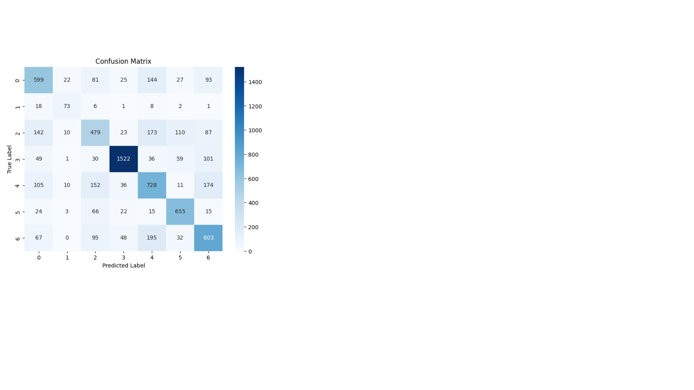

# FER2013 Emotion Recognition Using Transfer Learning with CNN

## Objective
Classify facial emotions from grayscale images using a pre-trained CNN and transfer learning.

## Dataset
FER2013: 35,887 grayscale images (48x48 pixels) labeled with 7 emotions:
- 0: Angry
- 1: Disgust
- 2: Fear
- 3: Happy
- 4: Sad
- 5: Surprise
- 6: Neutral

## Method
- Used a pre-trained CNN (e.g., ResNet50/VGG16) as the base model.
- Applied Transfer Learning: froze base layers and fine-tuned top layers on FER2013.
- Fine-tuning was done in **two phases**:
  - **Phase 1:** Initial fine-tuning on FER2013.
  - **Phase 2:** Further fine-tuning with data augumentation, Test-Time Augmentation (TTA) and hyperparameter adjustments.
- Data augmentation applied: rotation, shift, zoom, horizontal flip.
- Used Test-Time Augmentation (TTA) in Phase 2 to improve accuracy.

## Results

### Without TTA
- Accuracy: 69.7%
- Macro F1-score: 0.6769

### With TTA
- Accuracy: 70.37%
- Macro F1-score: 0.68

### Classification Report (TTA)
| Class | Precision | Recall | F1-score | Support |
|-------|-----------|--------|----------|---------|
| 0     | 0.66      | 0.56   | 0.61     | 991     |
| 1     | 0.63      | 0.68   | 0.65     | 109     |
| 2     | 0.64      | 0.48   | 0.55     | 1024    |
| 3     | 0.89      | 0.88   | 0.89     | 1798    |
| 4     | 0.58      | 0.63   | 0.61     | 1216    |
| 5     | 0.75      | 0.86   | 0.80     | 800     |
| 6     | 0.62      | 0.72   | 0.66     | 1240    |

## Confusion Matrix(for Phase 2 before TTA)

## Training & Validation Graphs(Phase 1 and 2)
![Accuracy & Loss Curves]
Phase 1 (images/Phase 1 Graphs.png)
Phase 2 (images/Phase 2 graphs.png)
## How to Run
- Open the notebook `CNN with transfer learning.ipynb` in Kaggle or local Jupyter.
- Run all the cells. 
## Future Work / In Progress
- Explore CK+ dataset for emotion recognition.
-Switch from FER2013 to a larger, cleaner dataset (RAF-DB) for better generalisation.
- Fine-tune a lightweight backbone (ConvNeXt-Tiny / EfficientNet-B0) with strong augmentation and class-balanced loss to improve minority-class performance.
- Evaluate cross-dataset performance (train on RAF-DB, test on FER2013/CK+) to demonstrate robustness.
